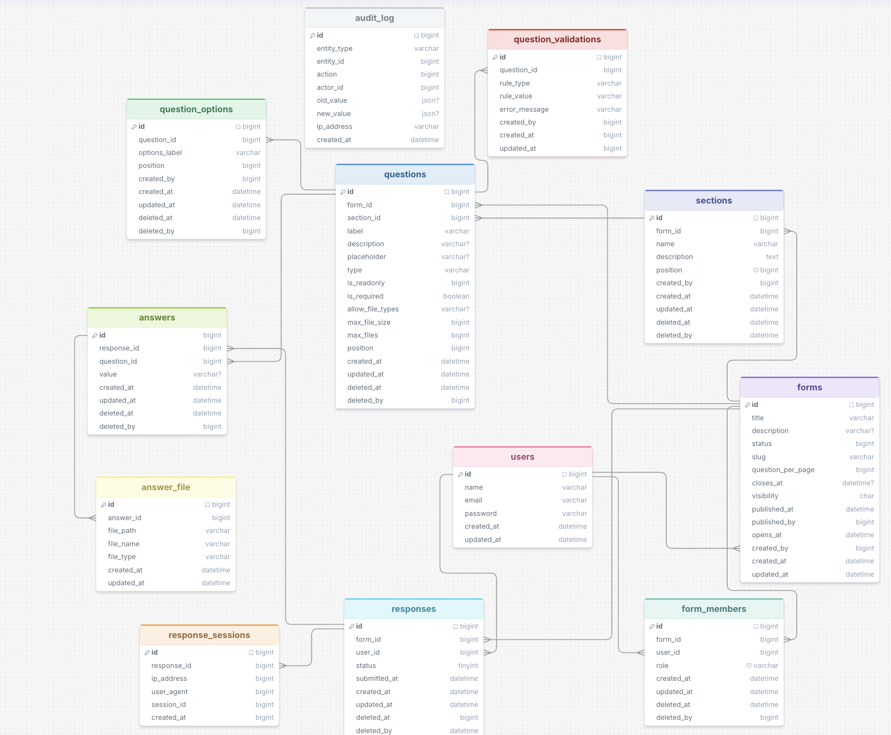

# Form Builder Schema Documentation 

## Achitechture Overview

The system is designed to support structured data collection with grouping, validation and auditing.

---

### Design Pattern

- **Process** : Form -> Section -> Question -> Question Options
- **Submission** : Responses are stored separately 
- **Auditability** : Every major entity includes timestamps for created, updated and deleted 
---

### Layers

**Form Builder Layers**

| Tables | Description |
| ----------- | ----------- |
| forms | Create a form that generates slug, defines number of question in a page  |
| sections | Creates grouping of questions |
| form_members| Add editor, viewers to a private form|
| questions | Create question with dynamic input types, define number of files and size when submitting with positioning number for display |
| question_options | Creates options for choice type questions|
| question_validation | Stores Regex or boundary rules |
---
**Form Submission Layers**

| Tables | Description |
| ----------- | ----------- |
| responses | Tracks the users filling the form  |
| answer | Maps a specific question's value |
| answer_file| Stores the uploaded file metadata |
| response_session | Tracks metadata information of user when submitting |

**Auditing Layer**
| Tables | Description |
| ----------- | ----------- |
| audit_log | Keeps record of any change in the entity (forms, sections, questions) |