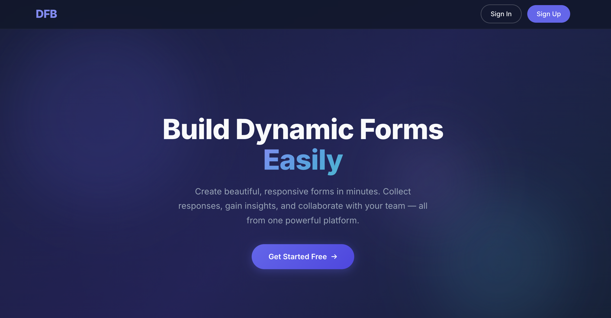

# Dynamic Form Builder Theme Documentation


## Overview

The `dynamic_form` theme is a Drupal 7 theme built specifically for the Dynamic Form Builder (DFB) platform. 

| Property         | Value                                           |
|------------------|--------------------------------------------------|
| **Theme Name**   | `dynamic_form`                                   |
| **Core Version** | Drupal 7.x                                       |
| **Base Theme**   | None                               |
---
## File Structure
```
sites/all/themes/dynamic_form/
├── dynamic_form.info      # Theme metadata, regions, asset declarations
├── template.php           # Preprocess functions
├── css/
│   └── style.css          # Design Styling
├── js/
│   └── main.js            # Interactive behaviors 
└── template/
    └── page.tpl.php       # Home page template 
```
---

## Page Template (`page.tpl.php`)

The `page.tpl.php` file is a full HTML page for the home page.


### Role-Based Dashboard Routing

The template detects the current user's role and sets the dashboard URL accordingly:

```php
global $user;
$roles = $user->roles;

if (in_array('admin', $roles) || in_array('super administrator', $roles)) {
  $dashboard_url = url('admin');
} else {
  $dashboard_url = url('user');
}
```

| Role                | Dashboard Destination |
|---------------------|-----------------------|
| `admin`             | `/admin`              |
| `super administrator`| `/admin`            |
| `member` (default)  | `/user`               |


---

## Template Preprocessor (`template.php`)

The `template.php` file contains preprocess functions. 

### Functions

| Function                           | Purpose                                                |
|------------------------------------|--------------------------------------------------------|
| `dynamic_form_preprocess_page()`   | Adds `page-login`, `page-register`, `page-front` to `$classes_array` |
| `dynamic_form_preprocess_html()`   | Same classes added at the `<html>` level               |


---

## Authentication Pages

The login (`/login`) and register (`/register`) pages are rendered by the `dynamic_form` module with styling done by this theme.

